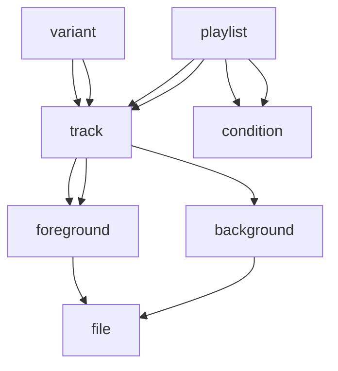

- Feature Name: Music system
- Affected audience: Game developers, plugin creators, composers
- RFC PR: Coming soon. Waiting on previous audio PRs.
- Relevant Issues/RFCs: #233, #3594, #6749, #7538, #9539, #10008, #10658, #11065, #11664, and the #Music for Endless Sky thread in the Discord server.

# Summary
This RFC defines a multi-layered music system with full backwards compatibility, supporting extensions via plugins.

# Motivation
Better music support has been a long-requested feature. Though MZ originally didn't like the idea of background music, he did add basic support eventually.

This has since been extended to enable playing music via certain triggers in missions, but in general, music is not supported in any depth.

# Detailed Design

> [!NOTE]
> Even though I had this system figured out in detail six months ago, I failed to document most of it, so there is a chance that I'm missing some crucial details here.

## High-level overview

The basic design of the system reflects the opinions of the composers on the [music survey](https://discord.com/channels/251118043411775489/989659299645100112/1338099088226254881). The hierarchy is as follows:


(One arrow signifies a one-to-one relationship, two arrows signify one-to-many.)

Music is organized into `playlists`. Each `playlist` holds a list of `tracks` and a set of `conditions` shared amongst those `tracks` to define music for an area of space. The normal way of assigning music to an area would be to create a `playlist` with the required `tracks` and adding a `location filter` to it. The engine would try to play tracks from the same playlist, if possible.

Each `track` is made up of a `background layer` and several (possibly zero) `foreground layers`. The `background layer` is the equivalent of the previous single music layer; it plays a single file, and if we were to switch to another `track` while it is playing, it may be cross-faded. (More on that later.)

`Tracks` also have various `foreground layers`. These are all independent of each other and of the `background layer`, playing random music from their own set of audio files. These are designed to add either ambiance or small variations to the music; while `background layer` files are long, `foreground layer` files should be short.

In some cases, we may want to have multiple, slightly different versions of a `track` playing under different conditions. For instance, you have a "combat" Deep soundtrack and a "relaxed" Deep soundtrack. In this case, the following setup is required:
 - Create a different `track` for every version of the audio. This creates two sets of `tracks`, one for "combat" and one for "relaxed" music.
 - Create two `playlists`, one for each soundtrack.
 - For the "relaxed" soundtrack, specify an `autocondition` that measures the enemy's combat strength, or some other "combative" property (note: this requires new `autoconditions` in the engine).
 - For the "combat" soundtrack, do the same but with the inverse "combative" `condition`.
 - For each `track` that has both a "combat" and "relaxed" version, create a `variant`.

A `variant` is basically a pairing of two `tracks` that tells the engine "these are pretty much the same, just switch them out and keep playing from the same position, and skip the fade". When the current `track` changes, their `variant` status is checked. If they are `variants`, there is no fade.

There is also a special `track` keyword `silence`. This can be used in place of a `track`'s name in a `playlist` definition to signify a duration of silence. This `silence` keyword is also available in `track` definitions in place of a filename to enable silent `background` or `foreground` layers.

## Playlist specification

`Playlists` may be defined in the data files as such:
```
playlist "playlist name"
    tracks
        <name>
        ...
    "to play"
        ...
    "play at"
        ...
```
where `"to play"` is a condition set, and `"play at"` is a location filter. When a `playlist` is redefined, the union of the old and new definitions is taken for every node.

Any `track` entry can also be `silence <duration>`, as described below.

## Track specification

There is an implicit `track` definition created for every sound file, using the standard naming scheme (for instance, the `ambient/machinery` track would be created for `ambient/machinery.mp3`). This enables swapping out any previous music references to `tracks` in the engine. These `tracks` have their associated file as the `background layer` and have no `foreground layers`, being the equivalents of the previous music definitions.

Custom `tracks` can be defined (with multiple `layers`) using the data syntax:
```
track "track name"
    background <file>
    foreground
        <file>
        ...
    ...
```
Multiple `foreground layers` can be defined, each taking a list of files. The `background layer` is singular and takes only a single file. Only files can be used here, not other tracks. When a `track` is redefined, the previous definition is discarded, but its `variant` status is preserved with other `tracks`.

Any file parameter accepts `silence <duration>` as a value, with `duration` denoting the length of the silence in seconds (accepting decimals). `Silence` is also supported as a `track` name in `playlists` and other `track`-accepting music nodes.

## Variant specification

```
variant <track> <track> ...
```
marks the tracks as variants of each other. A `track` is implicitly a `variant` of itself, and declaring so in a `variant` node should generate a warning. `Silence` cannot be used in `variants`.

Usually, when `tracks` are switched during playback, the new `track` begins playback from the beginning, and the `tracks'` `background layers` are cross-faded. This is skipped for `variants`, and the new `track` resumes from the same position as the old one. This behaviour only applies to the `background layer` however; the `foreground layers` always behave the same way. They each wait for their currently playing file to finish, and only then do they pick a new file from the new track. (However, if there are more `foreground layers` in the new track than the old one, those can begin playback immediately.)

## Runtime behaviour

When there is no music playing and there are available `playlists`, a random one is chosen for playback. Its `tracks` are shuffled and played without repetition until either:
- each `track` has been played once, or
- the `playlist`'s conditions no longer match.

When this happens and no other `playlist` is available, the `playlist` stops playing the current `track`, fading into silence.

If there are other `playlists` that can be played, a random one is chosen in two rounds, based on the currently playing `track`:
- If there is a `playlist` with at least one `variant` `track` available (including the same track), it is chosen and the `variant` `track` is resumed as described above.
- If there are no such `playlists`, a random one is chosen. The current `track` is cross-faded with the randomly-chosen first `track` of the new `playlist`.

The conditions of the active `playlist` shouldn't be checked every frame to avoid rapid switching. It is probably sufficient to check them every 1-3 seconds.

When the player enters a system with a music node defined, the following happens:
1. All normal `playlists` are treated as invalid.
2. The system's `track` is treated as if it were used in a single-`track` `playlist` - the only valid playlist.
3. The new playlist is chosen, which is inevitably the system's pseudo-`playlist`. All `variant`-related playback rules are adhered to as usual.
4. If the player stays in the system long enough for the `track` to finish, a new `playlist` is chosen - and as before, the only option is the system's music.
5. Upon leaving the system, the `playlist` becomes invalid as any other would. At this time, the standard `playlists` would no longer be treated as invalid, and would be chosen to replace the system's music.

When a mission trigger plays a `track`, the behaviour is different:
1. The current `track` stops playback. The active `playlist` is discarded.
2. The mission's `track` starts playing from the beginning. `Variant`-related playback rules are NOT followed.
3. When the mission's `track` finishes, a new `playlist` is chosen as usual. There is no guarantee that the previously playing `playlist` will be resumed here.

> [!NOTE]
> An experimental demo of this system is available at https://tibetiroka.com/music with limited functionality.

# Drawbacks
Having multiple music `layers` increases complexity and file I/O operations. It can also increase the number of audio output sinks used, though we can mix the music samples before sending them to the operating system if necessary.

As music is often streamed, there is no easy way to guarantee that an audio file begins playback immediately. If we want to keep the foreground layers in sync with the background layers (and we do), we have to cache or preload the foreground layer and the beginning of the background layer.

# Alternatives
Alternatives have been discussed extensively regarding the previous music PRs. Though much of the structure is preserved from the previous solutions, there are some key differences:
- `Variants` are now for `tracks`, not for audio files. They are also arbitrarily defined, and are not required for the combat/non-combat switching to work properly.
  - As it isn't reasonable to expect every `track` to have a combat `variant`, the new approach enables playing dedicated combat music in scenarios where previously regular music would have been played. This is helped by moving the combat `variants` to another `playlist` from the file specification of `tracks`.
- `Tracks` can have multiple audio layers playing concurrently.
  - This choice was made based on the results of the creator survey, and was not known at the time of the previous discussions.
- `Playlists` are now "play once", not "play forever". This fixes various issues where players could get stuck listening to the same few songs when many others were also available.
  - This change makes it much easier to have, for example, "generic human" tracks in a dedicated `playlist` while still having dedicated `tracks` in each region's own `playlist`.

# Unresolved Questions
Should `playlists` have playback modes other than "shuffle"? Though we have experienced extensive issues with ordered playback, some other playback modes still might be viable.

Is there a use for weights to `playlists`?

If a previously playing `track` is still being faded out when a new `playlist` is being chosen for playback, should we check if there is a valid `playlist` with this `track`? And if so, should we un-fade this `track` and resume playback?

Should existing music nodes take `playlist` names instead of `tracks`?

Should `playlists` keep track of which of their `tracks` have been played, and only re-shuffle when they have all been played an equal number of times? How would this interact with `variant`-based `playlist` switching?

`Playlists` could have a `priority` node that allows forcibly terminating the current `playlist` in favor of another when its conditions become valid. This would simplify the condition setup for combat `playlists`, but would make it more difficult to control when these prioritized `playlists` would yield to the non-prioritized `playlists`. These are also more difficult to extend with plugins, as various plugin-made priority `playlists` could easily clash with each other.