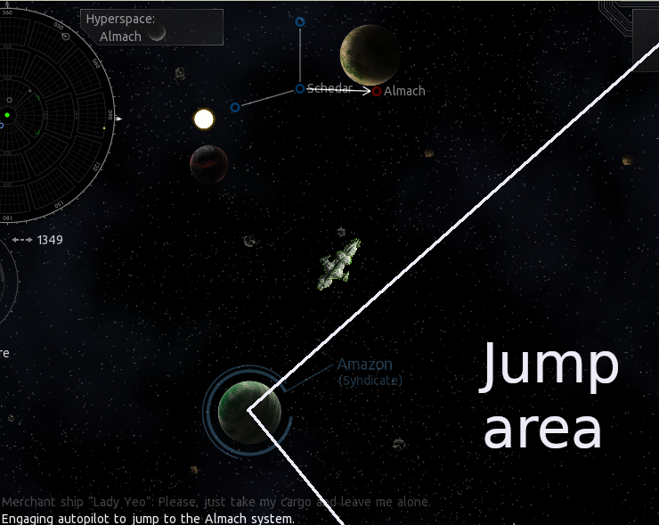

- Feature Name: Hyperspace and Jump arrival and departure modifiers
- Affected audience: Game Developers, Content Creators, Plugin Authors
- RFC PR: [ESC-51](https://github.com/EndlessSkyCommunity/endless-sky/pull/51)
- Relevant Issues/RFCs: [Feature Request](https://github.com/endless-sky/endless-sky/issues/4334)

# Summary
This is a proposal for a list of keywords that sets limits on the locations where players and NPCs can arrive into a system and depart from a system.

# Motivation
The arrival distance modifiers could improve space battles (because long range weapons make more sense when fleets start further away from eachother).
The arrive and departure distance modifiers were also present in Escape Velocity, so adding those features will also improve the options for using Endless Sky for a port of Escape Velocity.

# Detailed Design
## System and Planet Arrival/departure

```arrival <distance> ["link"] ["jump"]```
System property and/or planet property. The <distance> indicates the minimum amount of distance (from respectively the system center or the planets center) at which ships arrive when entering the system.
If the property is given on multiple places, then the maximal distance is used.
If link keyword is given, then the arrival distance only applies to incomming hyperlinks.
If jump keyword is given, then the arrival distance only applies to incomming jumps.

```
departure <min> [<max>] ["link"] ["jump"]
    angle <nr>
```

System property and/or planet property. The <min> indicates the minimum distance that a ships needs to be away from respectively the system center or planet center before the ship can start a jump.
If a maxium is given, then a ship needs to be no more than distance away from the centers to be able to leave.

### Angle

If an angle is given, then the ship needs to be at the proper distance, but also in the proper direction of leaving (within the range given by angle). Angle is a number between 0 (which would make it impossible to jump) and 180 (which would remove any angle restrition).
For example if planet Amazon would have a angle restriction of 45 degrees for jumps, then a jump to Almach (on the right) could only happen from the Area marked "Jump Area" in this picture.


### Multiple properties

If multiple properties are given, then all departure constraints need to be fullfilled before a ship can make the jump.
Content creators need to be aware of blocking jumps if constraints are conflicting, they might also acutally want to use this, for example by having a system where jumps are only possible once every four days (due to planet alignments).


## Ship Arrival/departure modifiers

```
arrival [<min>] ["link"] ["jump"]
	modifier <nr>

departure [<min> [<max>]] ["link"] ["jump"]
	modifier <nr>
```
Ships properties. <min> gives the minimum arrival and departure distances for ships. If a system or planet also has minimum arrival and departure distances then the maximum of all distances will be used for the actual distance.
Ships can also have a maximum departure distance (if a minimum is set).
The min property is optional; it is also possible that only a modifier gets set.
A modifier can be given to "widen" or "narrow" the windows at which ships can depart, where positive numbers widen the range.
New ranges get calculated as:
```
min_distance_modified = min_distance * (1-modifier)
max_distance_modified = max_distance * (1+modifier)
```
Modifiers also work on the properties of the ship itself, this allows for creation of a "navigation computer" that does not actually perform jumps, but that does affect jump distances.

## Combat jump behaviours

```
combat visibility <value>
```
(System property)
Allow ships to arrive at the most appropriate distance for combat (based on their personality).
When this is false, then all ships will arrive as if the system has no combat.
When this is true, then fleets with "heroic" and other military personalities could arrive just beyond their maximum weapons range (allowing the long-range weapons to be used before short-range weapons are used).
When this is true, then unarmed carriers could arrive outside weapons ranges whenever possible.
When this is true, then fleets with merchant type of personalities could arrive at a large distance from the combat area (trying to avoid combat), based on their personalities.


```
combat detection <value> ["link"] ["jump"]
```
(Ship property)
The ability (strength) of a ship to detect combat and combatants (in general or for hyperlink or jump only). Related to the `combat visibility` system property.


```
arrive focusable <value>
```
(Planet property)
Allow automatically aiming for this planet when arriving in the system. The default value if this value is not given is true.

# Drawbacks
The `combat visibility` option could be stronger, for example by incorporating hyperspace link communication between friendly factions.

# Alternatives
The keywords might be named differently and we might change the workings of one or more features (instead of some maximum ranges, use minimum ranges).

# Unresolved Questions
As indicated above, `combat visiblity` still has quite some room for improvement.
Players might also want to set the arrive distances manualy. That is not included in this RFC (neither why we don't allow it and neither how it would work if we do allow it).
